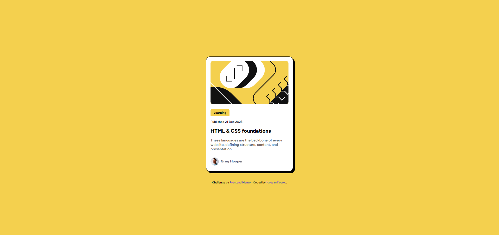
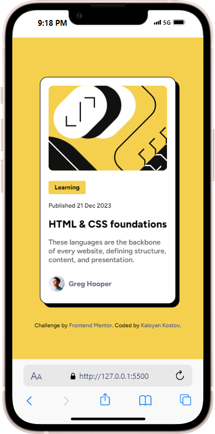

# Frontend Mentor - Blog preview card solution

This is a solution to the [Blog preview card challenge on Frontend Mentor](https://www.frontendmentor.io/challenges/blog-preview-card-ckPaj01IcS). Frontend Mentor challenges help you improve your coding skills by building realistic projects.

## Table of contents

- [Frontend Mentor - Blog preview card solution](#frontend-mentor---blog-preview-card-solution)
  - [Table of contents](#table-of-contents)
  - [Overview](#overview)
    - [Screenshot](#screenshot)
    - [Links](#links)
  - [My process](#my-process)
    - [Built with](#built-with)
    - [What I learned](#what-i-learned)
  - [Author](#author)

**Note: Delete this note and update the table of contents based on what sections you keep.**

## Overview

### Screenshot

### Links

- Solution URL: [https://github.com/Kaloyan-Kostov/Frontend-Mentor-Blog-Preview-Card](https://kaloyan-kostov.github.io/Frontend-Mentor-Blog-Preview-Card)

## My process

### Built with

- Semantic HTML5 markup
- CSS media queries

### What I learned

I expanded my skills around styling elements/components for mobile/desktop view.

## Author

- GitHub - [Kaloyan-Kostov](https://github.com/Kaloyan-Kostov)
- Frontend Mentor - [@Kaloyan-Kostov](https://www.frontendmentor.io/profile/Kaloyan-Kostov)
